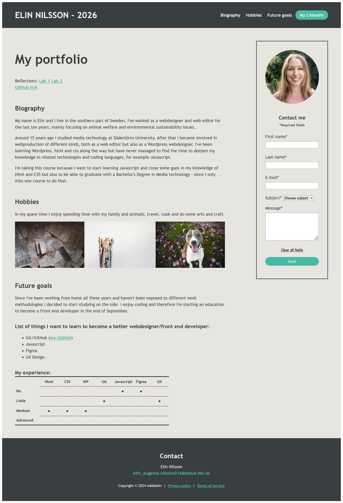

# Lab 2 - Javascript for web development
Kristianstad University

Individual assignment

## Project description
In the JavaScript for Web Development course at Kristianstad University, I created a simple, responsive portfolio website using **HTML**, **CSS**, and **JavaScript**.

The portfolio website itself, built with HTML and CSS, was created a year earlier in Lab 1, when I took the same course. Lab 2, on the other hand, focused on the challenge of integrating JavaScript into the form, including tasks like validating form fields and displaying error messages.

## Tech Stack

[](https://developer.mozilla.org/en-US/docs/Web/HTML)

[](https://developer.mozilla.org/en-US/docs/Web/CSS)

[](https://www.ecma-international.org/publications/standards/Ecma-262.htm)


## 🔗 Link
https://github.com/webbelin/HKR-lab2

## Setup instructions
To run the website locally:

1. Clone the repository:
   ```bash
   git clone https://github.com/webbelin/HKR-lab2
    ````
 
2. Navigate into the project directory:

   ```bash
   cd HKR-lab2
   ```

3. Open 'index.html' in your browser.

## Screenshot
**Portfolio screenshot**
